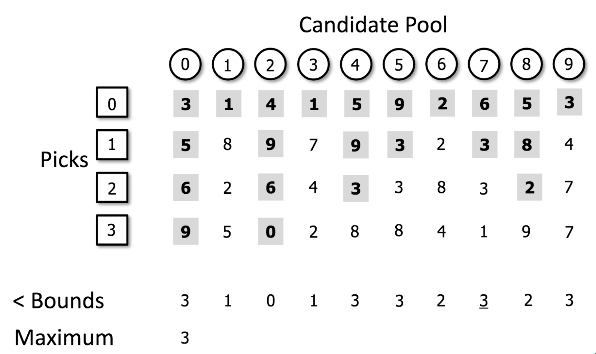

# MaxMinPicker revisited

This post has a bit of history. It is primarily inspired by 
[Roger Sayle's talk](https://github.com/rdkit/UGM_2017/blob/master/Presentations/Sayle_RDKitDiversity_Berlin17.pdf)
at the recent [UGM in Berlin](https://github.com/rdkit/UGM_2017). 
If you have attended these great events you will know that Roger's talk is one of the highlights. 
In a way that only Roger can, he picks an area of the RDKit and tears it to pieces. 
Having done so he reassembles those pieces using his immense computer science brain
and the result is something improved. Greg sits there not quite knowing what is coming, but assured that the 
outcome will be positive!

This time he picked on (pun!) the MaxMinPicker algorithm in RDKit.
This also has history, as it was the subject of [a blog](http://rdkit.blogspot.co.uk/2014/08/optimizing-diversity-picking-in-rdkit.html)
by Greg from 2014 (and also [this one](http://rdkit.blogspot.co.uk/2014/08/picking-diverse-compounds-from-large.html)).

The most obvious approach to picking a diverse subset might be to start with clustering the dataset e.g. using Butina Clustering and
then picking from each cluster. Indeed that's exactly what I've done
[here](https://github.com/InformaticsMatters/pipelines/blob/master/src/python/pipelines/rdkit/cluster_butina.py).
But as Roger pointed out this does not scale as the full distance matrix is needed which, assuming a symmetric distance function, 
is (n^2 - n)/2 in size. Something smarter is needed for large datasets.

In fact the MaxMinPicker (see [here](http://rdkit.org/docs/cppapi/classRDPickers_1_1MaxMinPicker.html) for C++ or 
[here](http://rdkit.org/docs/api/rdkit.SimDivFilters.rdSimDivPickers.MaxMinPicker-class.html) for Python docs) also has the option 
to pass in the full distance matrix which will also have the same limitation. But the key to MaxMinPicker
(described in Ashton, M. et. al., Quant. Struct.-Act. Relat., 21 (2002), 598-604) is that the full distance matrix does not
need to be generated, only a subset of it, and it can be generated as needed in a lazy manner.

The algorithm works as follows.

1. Generate descriptors (e.g. Morgan fingerprints) for all the molecules, both any initial seeds plus those to pick from (the candidate pool). 
For large sets this will be slow, but cannot be avoided. 
2. If there are no initial seeds select an initial molecule at random from the candidate pool and it becomes the sole member of the picked set.
3. From the molecules in the candidate pool find the one that has the maximum value for its minimum distance to molecules in the picked
set (hence the MaxMin name), calculating and recording the distances as required. 
This molecule is the most distant one to those already picked so is transferred to the picked set. 
4. Iterate back to step 3 until your are complete (e.g. you have picked the required number of molecules).

Step 3 here is the key one, and the one that Roger improved as we will see. The process is indicated in slide 11 from 
[Roger's presentation](https://github.com/rdkit/UGM_2017/blob/master/Presentations/Sayle_RDKitDiversity_Berlin17.pdf)
and is repeated here:



The key is to think of traversing the table column by column starting from the left. You move all the way down the first column
to find the minimum value (3 in this case) and this becomes your first maximum value. Then for the remaining columns you move 
down the values until you reach a value that is less than or equal to your current maximum. If you hit such a value you know that 
molecule is more similar than your current candidate so can be discarded, so you can immediately move onto the next column. If you 
reach the bottom of a column and your minimum value for that column is greater than the minimum value for your current candidate then
that compound now becomes your current candidate as it is more distant than the original one.
As you traverse the columns you calculate and record the distances if they have not already been calculated. This lazy evaluation of
the distances is key to the efficiency of the algorithm. A distance is only calculated if it is needed, and it is never calculated twice.
This is the aspect that Roger spotted was not implemented in the old version, and he improved as described in his talk.

So what does this all mean? Roger's new version will be present in the 2017_09_01 version of RDKit (now released), and the tests we 
show here use a beta version of this, and compare timings against the 2017_03_03 version that had the old implementation that performs
many more unnecessary distance calculations. 

The results are shown in this [Jupyter notebook]().

First we look at the LazyPick method:

```python
picks = mmp.LazyPick(fn, len(benzodiazepines), start_with + how_many_to_pick, list(range(start_with)))
```

Let's explain the arguments to this function:

1. `fn`: This is the distance function
1. `len(benzodiazepines)`: the total number of descriptors, the initial seeds plus those to pick from 
1. `start_with + how_many_to_pick`: the number of indexes to return (including the initial seeds)
1. `list(range(start_with))`: a list of the indexes of those in the initial pick list. Typically [1,,2,3...], but can be None

What is returned is the indexes of all those that are picked, the original seeds followed by those that have been picked. 

We compare this to the LazyBitVectorPick function. This does not allow a distance function to be defined but instead
uses Tamimoto distance between the bit vectors. Whilst this is a restriction, that's exactly what we are using, and what
most people will want to use in most cases, so it's not too much of a limitation. The plus side is that this allows less
too and fro between the C++ and Python layers so performs much better.

```python
picks = mmp.LazyBitVectorPick(benzodiazepines, len(benzodiazepines), start_with + how_many_to_pick, list(range(start_with)))
```

Timings for picking a number of molecules from a total set of 12386 benzodiazepines given a number of seeds can be seen below.
All timings were gathered on an i5 based MacBook Pro with 8GB RAM.
You can use the Jupyter notebook to run these, and other combinations, yourself.

    Method            | Seeds | Picks | Old time | New time | Improvement
    LazyPick          |     0 |   100 |   	17.5 |     0.67 |          26
    LazyPick          |     0 |  1000 |   1523.9 |    13.94 |         109
    LazyPick          |   100 |   100 |     81.6 |     1.41 |          58
    LazyPick          |  1000 |  1000 |       ND |    27.22 |          
    LazyBitVectorPick |     0 |   100 |     12.9 |     0.09 |         143
    LazyBitVectorPick |     0 |  1000 |   1466.7 |     1.39 |        1055
    LazyBitVectorPick |   100 |   100 |     72.1 |     0.18 |         401
    LazyBitVectorPick |  1000 |   100 |    761.3 |     0.54 |        1410
    LazyBitVectorPick |   100 |  1000 |   3105.8 |     1.38 |        2251
    LazyBitVectorPick |  1000 |  1000 |       ND |     3.03 |
    LazyBitVectorPick |  5000 |  1000 |       ND |     7.37 |
    LazyBitVectorPick |  5000 |  5000 |       ND |     7.37 |

Times are in seconds and averages of 3 replicates.

Firstly you'll notice that the LazyBitVectorPick function is significantly faster than the LazyPick one especially for the new algorithm.
As a result additional calculations were done with just LazyBitVectorPick. 

The new algorithm is most remarkable in the way it scales, and the bigger the problem to solve the bigger the improvement.
Large studies that are impractical with the old algorithm now run in seconds.

So how can this be used for some more realistically scaled studies? Compound collections will often be in the order of several 100,000's,
and those for Pharma companies in the range of a few million. Vendor catalogs that can be picked from can often be in the range of 100,000 
compounds. So we set up an study that tried to approach this sort of scale. We chose the NCI250 dataset (comprising 247,477 smiles that 
RDKit can handle) as the compounds that we already possess, and pick from the benzodiazepine set of 12386 compounds.
This can realistically only be done with the new algorithm.

The Jupyter notebook shows how this can be done. Timings are as follows:

    Picks | Time (sec)
	    1 |    8.4    8.5    8.7
	    2 |  137    133    128
	    3 |  222    218    223
	   10 | 1029   1006   1030
	  100 | 1201   1181   1199
	 1000 | 1256   1187   1245

Impressive. Large scale compound selection done of a modest laptop in minutes. 

Are there no limits? Well, for very large sets holding all the fingerprints and picking data in memory will become limiting, and 
generating the descriptors in the first place will take time.
Roger informs me of a study he has done selecting 2000 diverse compounds from the ~90M in PubChem Compound that took 12.6 hours to read
the molecules and generate fingerprints and then 2.5 hours for diversity selection.  Memory used was ~25 gigabytes.
So here we are a little beyond a trivial application on a laptop, but not massively so. Impressive!
  
Finally, when running some of these longer jobs it was noticeable that only one core of the machine was being used. Clearly the 
MxMinPicker is not written to be multi-threaded, though, in principle it seems that it could be sped up considerably by being able to
utilise all the cores, though this would not be trivial. So there is still scope for further improvement. Maybe another challenge for Roger!
